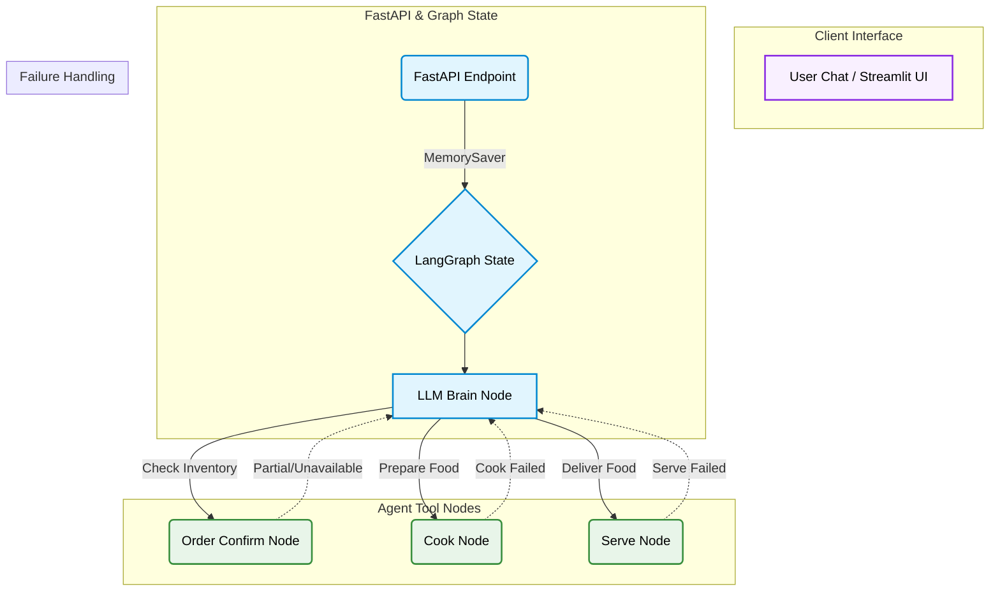

<div align="center">

# Restaurant Agent

**An intelligent, multi-turn AI restaurant ordering system powered by LangGraph and FastAPI.**

[](https://fastapi.tiangolo.com/)
[](https://python.langchain.com/docs/langgraph)
[](https://groq.com/)
[](https://streamlit.io/)
[](https://docs.pydantic.dev/)

</div>

---

## Overview

Developed a robust, production-ready AI agent system that fully automates restaurant order management. The architecture leverages LangGraph to create a stateful, fault-tolerant workflow handling order extraction, inventory confirmation, kitchen processing (cooking), and serving. Human-in-the-loop interactions and smart retry mechanisms handle edge cases like partial inventory and kitchen failures seamlessly.

---

## Architecture Overview



---

## Features

| Component                       | Description                                                                                                                                  |
| ------------------------------- | -------------------------------------------------------------------------------------------------------------------------------------------- |
| **Dynamic Order Extraction**    | Uses Groq's structured outputs via Pydantic to accurately parse dish names, quantities, and intent (e.g., ordering vs. unrelated chat).      |
| **Stateful LangGraph Workflow** | Maintains strict conversational and order state using `MemorySaver`, allowing multi-turn conversations and human-in-the-loop confirmation.   |
| **Inventory Verification**      | Dynamically checks requested items against a live menu dictionary. Handles partial orders by routing back to the user for approval.          |
| **Fault-Tolerant Execution**    | Implements robust retry mechanisms (3 order attempts, 2 cook attempts, 2 serve attempts) simulating real-world kitchen and serving failures. |
| **Production Architecture**     | Fully containerized with a FastAPI backend exposed on Render, coupled with a seamless Streamlit chat interface.                              |

---

## Technology Stack

| Component            | Technologies                                |
| :------------------- | :------------------------------------------ |
| **Agent Framework**  | `LangGraph`, `LangChain`                    |
| **LLM Inference**    | `Groq` (model: `openai/gpt-oss-120b`)       |
| **Data Validation**  | `Pydantic`, `Pydantic-Settings`             |
| **API & Backend**    | `FastAPI`, `Uvicorn`                        |
| **Frontend UI**      | `Streamlit`                                 |
| **Testing**          | `Pytest`                                    |
| **Containerization** | `Docker`, `uv` (Fast Dependency Resolution) |

---

## Project Structure

```text
Restaurant-Agent/
├── app/
│   ├── __init__.py
│   ├── config.py           # Environment & Settings
│   ├── graph.py            # LangGraph Nodes & Edges
│   ├── main.py             # FastAPI Application
│   └── models.py           # Pydantic Schemas
├── tests/
│   ├── __init__.py
│   └── test_scenarios.py   # Pytest Scenarios
├── .env                    # Groq API Keys
├── Dockerfile              # Container configuration
├── render.yaml             # Render Blueprint IaC
├── pyproject.toml          # UV Dependencies
└── streamlit_app.py        # Streamlit Chat UI
```

---

## Setup & Execution

### 1. Environment Initialization

```bash
git clone https://github.com/Shashank17singh/Restaurant-Agent.git
cd Restaurant-Agent
uv sync
```

### 2. Configure Environment Variables

Create a `.env` file in the root directory and add your Groq API Key:

```env
GROQ_API_KEY=your_api_key_here
```

### 3. Run the Backend API

```bash
uv run uvicorn app.main:app --port 8000 --reload
```

The FastAPI swagger docs will be available at `http://127.0.0.1:8000/docs`.

### 4. Run the Streamlit UI

In a separate terminal, launch the chat interface:

```bash
uv run streamlit run streamlit_app.py
```

### 5. Run Tests

```bash
uv run pytest
```

---

## Deployment

- **API URL:** https://restaurant-agent-oarq.onrender.com/docs
- **Dashboard URL:** https://restaurants-agents.streamlit.app/

---

## Deep Codebase Analysis

| File                              | Purpose / Details                                                                              |
| --------------------------------- | ---------------------------------------------------------------------------------------------- |
| `.devcontainer\devcontainer.json` | Or use a Dockerfile or Docker Compose file. More info: https://containers.dev/guide/dockerfile |
| `app\__init__.py`                 | Core component logic and implementation details.                                               |
| `app\config.py`                   | Core component logic and implementation details.                                               |
| `app\graph.py`                    | Core component logic and implementation details.                                               |
| `app\main.py`                     | Core component logic and implementation details.                                               |
| `app\models.py`                   | Core component logic and implementation details.                                               |
| `render.yaml`                     | Core component logic and implementation details.                                               |
| `requirements.txt`                | Core component logic and implementation details.                                               |
| `streamlit_app.py`                | Core component logic and implementation details.                                               |
| `tests\__init__.py`               | Core component logic and implementation details.                                               |
| `tests\test_scenarios.py`         | Core component logic and implementation details.                                               |
